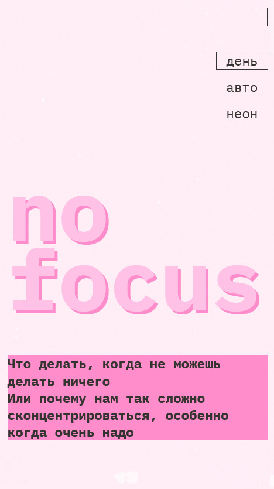
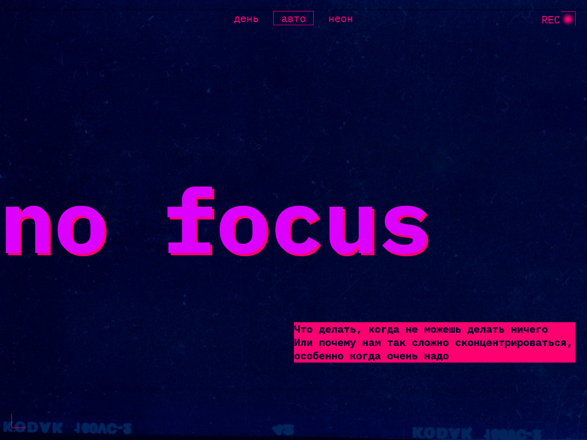
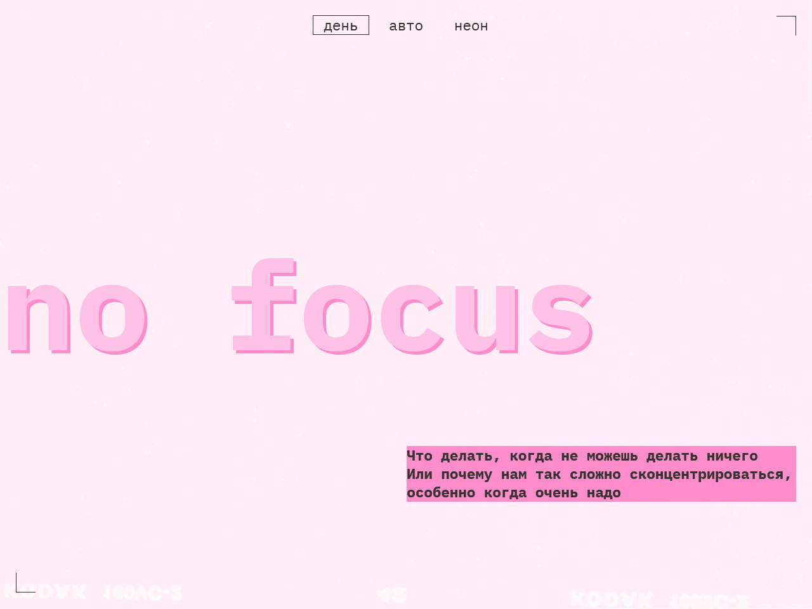

# Проект "Сложно сосредоточиться" от Яндекс Практикум

## Оглавление

- [Цель проекта](#Цель)
- [Стек](#Стек)
- [Скриншот](#скриншот)
- [Макет](#макет)
- [Ссылки](#ссылки)
- [Автор](#автор)
- [Благодарность](#благодарность)

### Цель проекта

Сверстать Блог, выполненный с адаптивной вёрсткой под мобильный экран, планшет и десктоп. Также была добавлена смена темы на "темную", "светлую" и авто, по усмотрению пользователя.

### Стек

- JavaScript
- HTML
- CSS

### Скриншот

### Макет

- Макет задания: [Figma](https://www.figma.com/design/sefS7XKhX8DhkZavlIu6yJ/3-спринт.-Проектная-работа--Copy-?node-id=0-1&p=f&t=yI2a6GbHfrkqoe4c-0)

### Ссылки

- URL решения: [Github](https://github.com/just01soul/slozhno-sosredotochitsya-fd.git)

## Автор

- Github - [Александр Христофоров](https://github.com/just01soul)

## Благодарность

Выражаю благодарность команде Яндекс Практикум за предоставление дизайна и уроков!
